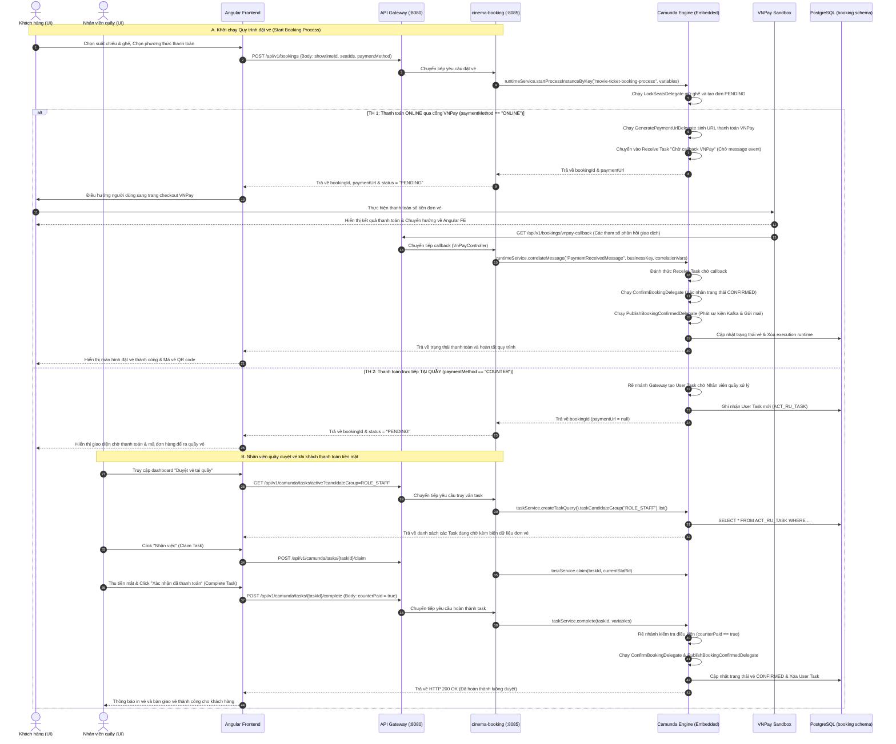

# Camunda Advanced Integration Guide - Angular & Spring Boot

Tài liệu này cung cấp hướng dẫn nâng cao để thiết kế, lập trình và vận hành quy trình BPMN phức tạp kết hợp giữa **Tác vụ tự động (Service Task)** và **Tác vụ phê duyệt thủ công của con người (User Task)**, tích hợp đồng bộ giữa **Angular Frontend** và **Spring Boot Backend (Camunda 7 nhúng)**.

---

## 1. Mô hình kiến trúc tích hợp (Integration Architecture Diagram)

Dưới đây là sơ đồ mô hình tích hợp kiến trúc giữa Angular Frontend, API Gateway, Spring Boot Backend (chứa Camunda Engine nhúng), và cơ sở dữ liệu PostgreSQL:


Sơ đồ tuần tự giao tiếp chi tiết giữa các thành phần khi thực thi nghiệp vụ đặt vé:



---

## 2. BPMN Quy trình Đặt vé xem phim (User Task, Service Task, Conditional Gateway & Expressions)

Quy trình nghiệp vụ đặt vé chính được thiết kế chạy trực tiếp trong tệp [booking-process.bpmn](file:///d:/sys_cinemas/cinema-microservices/cinema-booking/src/main/resources/bpmn/booking-process.bpmn).


### Kịch bản nghiệp vụ đầy đủ:
1. **Khởi động**: Khách hàng chọn suất chiếu và ghế trên Angular Frontend, click "Đặt vé" gửi yêu cầu thanh toán.
2. **Service Task 1 (Giữ ghế & Tạo đơn PENDING)**: Gọi [LockSeatsDelegate.java](file:///d:/sys_cinemas/cinema-microservices/cinema-booking/src/main/java/com/example/cinema/booking/infrastructure/camunda/LockSeatsDelegate.java) giữ ghế trong Redis/DB và sinh `bookingId`.
3. **Conditional Gateway (Phương thức thanh toán?)**: Cổng rẽ nhánh kiểm tra biến rẽ nhánh `paymentMethod`:
   - **Nhánh 1 (ONLINE)**: Điều kiện `${paymentMethod == 'ONLINE'}` $\rightarrow$ Sinh URL thanh toán VNPay và chuyển sang **Receive Task** chờ callback VNPay (có **Boundary Timer Event** 5 phút quá hạn).
   - **Nhánh 2 (COUNTER)**: Điều kiện `${paymentMethod == 'COUNTER'}` $\rightarrow$ Chuyển sang **User Task** dành cho nhân viên bán vé tại quầy (ROLE_STAFF) để thu tiền mặt trực tiếp (có **Boundary Timer Event** 15 phút quá hạn).
4. **User Task (Nhân viên quầy thu tiền mặt)**:
   - Dành cho nhóm ứng viên `ROLE_STAFF`. Nhân viên quầy nhận tiền và hoàn thành tác vụ trên Angular dashboard gửi kết quả `counterPaid = true` hoặc `false`.
5. **Conditional Gateway (Đã thanh toán tại quầy?)**:
   - Nếu `counterPaid == true` $\rightarrow$ Tiến tới Xác nhận đơn vé.
   - Nếu `counterPaid == false` $\rightarrow$ Chuyển sang Hủy đơn & giải phóng ghế.
6. **Service Tasks đầu ra**:
   - **Xác nhận đơn**: Gọi [ConfirmBookingDelegate.java](file:///d:/sys_cinemas/cinema-microservices/cinema-booking/src/main/java/com/example/cinema/booking/infrastructure/camunda/ConfirmBookingDelegate.java).
   - **Gửi Mail & Kafka**: Gọi [PublishBookingConfirmedDelegate.java](file:///d:/sys_cinemas/cinema-microservices/cinema-booking/src/main/java/com/example/cinema/booking/infrastructure/camunda/PublishBookingConfirmedDelegate.java).
   - **Hủy đơn**: Gọi [CancelBookingDelegate.java](file:///d:/sys_cinemas/cinema-microservices/cinema-booking/src/main/java/com/example/cinema/booking/infrastructure/camunda/CancelBookingDelegate.java).

---

## 3. Spring Boot Backend Code (REST API & Delegates)

API Controller đã được tạo thành công tại [CamundaTaskController.java](file:///d:/sys_cinemas/cinema-microservices/cinema-booking/src/main/java/com/example/cinema/booking/presentation/controllers/CamundaTaskController.java) trong dự án của bạn để cung cấp các endpoint giao tiếp với Angular.

### 3.1 REST Controller Endpoints

- **Khởi chạy Quy trình**:
  `POST /api/v1/camunda/process/start/{processKey}`
  Body: `{"ticketId": "TK-9988", "reason": "Bận việc đột xuất"}`

- **Lấy danh sách User Task đang chờ**:
  `GET /api/v1/camunda/tasks/active?candidateGroup=ROLE_ADMIN`
  *(Trả về danh sách ID, tên task, thời gian tạo, và toàn bộ biến dữ liệu đính kèm).*

- **Nhận quyền xử lý Task (Claim)**:
  `POST /api/v1/camunda/tasks/{taskId}/claim`
  *(Gán tên Admin đang đăng nhập vào cột Assignee để tránh người khác duyệt trùng).*

- **Nộp kết quả duyệt (Complete)**:
  `POST /api/v1/camunda/tasks/{taskId}/complete`
  Body: `{"adminApproval": true, "rejectReason": ""}`

---

### 3.2 Viết các Java Delegates thực thi nghiệp vụ (Service Tasks)
Dưới đây là mã nguồn triển khai thực tế các Bean Spring của Camunda Java Delegates phục vụ cho quy trình hoàn vé tự động và thủ công:

#### A. Kiểm tra điều kiện tự động (CheckRefundEligibilityDelegate)
Triển khai kiểm tra nghiệp vụ xem suất chiếu của đơn vé có cách hiện tại tối thiểu 24 giờ hay không:

```java
package com.example.cinema.booking.infrastructure.camunda;

import com.example.cinema.booking.domain.entities.Booking;
import com.example.cinema.booking.domain.repositories.BookingRepository;
import com.example.cinema.booking.infrastructure.feign.ShowtimeClient;
import com.example.cinema.booking.application.dto.feign.ShowtimeDTO;
import org.camunda.bpm.engine.delegate.DelegateExecution;
import org.camunda.bpm.engine.delegate.JavaDelegate;
import org.springframework.stereotype.Component;
import java.time.LocalDateTime;
import java.util.Optional;
import lombok.RequiredArgsConstructor;
import lombok.extern.slf4j.Slf4j;

@Component("checkRefundEligibilityDelegate")
@RequiredArgsConstructor
@Slf4j
public class CheckRefundEligibilityDelegate implements JavaDelegate {

    private final BookingRepository bookingRepository;
    private final ShowtimeClient showtimeClient;

    @Override
    public void execute(DelegateExecution execution) throws Exception {
        log.info("[CAMUNDA] Executing checkRefundEligibilityDelegate");
        String ticketId = (String) execution.getVariable("ticketId");
        
        Optional<Booking> bookingOpt = bookingRepository.findById(ticketId);
        if (bookingOpt.isEmpty()) {
            execution.setVariable("isAutoEligible", false);
            return;
        }

        Booking booking = bookingOpt.get();
        if (!"CONFIRMED".equals(booking.getStatus())) {
            execution.setVariable("isAutoEligible", false);
            return;
        }

        boolean autoEligible = false;
        try {
            Optional<ShowtimeDTO> showtimeOpt = showtimeClient.getShowtimeById(booking.getShowtimeId());
            if (showtimeOpt.isPresent()) {
                ShowtimeDTO showtime = showtimeOpt.get();
                LocalDateTime startTime = showtime.getStartTime();
                if (startTime != null && startTime.isAfter(LocalDateTime.now().plusHours(24))) {
                    autoEligible = true;
                }
            }
        } catch (Exception e) {
            log.error("[CAMUNDA] Error checking showtime details: {}", e.getMessage());
        }

        execution.setVariable("isAutoEligible", autoEligible);
    }
}
```

#### B. Thực hiện Hoàn tiền VNPay & Giải phóng ghế (RefundMoneyDelegate)
Delegate này gọi trực tiếp hàm nghiệp vụ hoàn tiền thực tế `bookingService.refundBooking(...)`:

```java
package com.example.cinema.booking.infrastructure.camunda;

import com.example.cinema.booking.application.ports.in.BookingService;
import org.camunda.bpm.engine.delegate.DelegateExecution;
import org.camunda.bpm.engine.delegate.JavaDelegate;
import org.springframework.stereotype.Component;
import lombok.RequiredArgsConstructor;
import lombok.extern.slf4j.Slf4j;

@Component("refundMoneyDelegate")
@RequiredArgsConstructor
@Slf4j
public class RefundMoneyDelegate implements JavaDelegate {

    private final BookingService bookingService;

    @Override
    public void execute(DelegateExecution execution) throws Exception {
        log.info("[CAMUNDA] Executing refundMoneyDelegate");
        String ticketId = (String) execution.getVariable("ticketId");
        
        if (ticketId != null) {
            bookingService.refundBooking(ticketId);
        }
    }
}
```

#### C. Từ chối hoàn tiền (RejectRefundDelegate)
Delegate ghi nhận từ chối từ admin và giữ nguyên trạng thái đơn vé:

```java
package com.example.cinema.booking.infrastructure.camunda;

import com.example.cinema.booking.domain.entities.Booking;
import com.example.cinema.booking.domain.repositories.BookingRepository;
import org.camunda.bpm.engine.delegate.DelegateExecution;
import org.camunda.bpm.engine.delegate.JavaDelegate;
import org.springframework.stereotype.Component;
import java.util.Optional;
import lombok.RequiredArgsConstructor;
import lombok.extern.slf4j.Slf4j;

@Component("rejectRefundDelegate")
@RequiredArgsConstructor
@Slf4j
public class RejectRefundDelegate implements JavaDelegate {

    private final BookingRepository bookingRepository;

    @Override
    public void execute(DelegateExecution execution) throws Exception {
        log.info("[CAMUNDA] Executing rejectRefundDelegate");
        String ticketId = (String) execution.getVariable("ticketId");
        String reason = (String) execution.getVariable("reason");
        String adminComment = (String) execution.getVariable("adminComment");

        log.info("[CAMUNDA] Ticket refund REJECTED for Booking ID: {}. Client reason: [{}]. Admin comment: [{}].",
                ticketId, reason, adminComment);
    }
}
```

---

## 4. Angular Frontend Code (Camunda Tasklist Dashboard)

Dưới đây là mã nguồn mẫu chi tiết cách xây dựng trang Tasklist trên Angular để truy vấn và phê duyệt các User Task từ Camunda.

### 4.1 Angular Service giao tiếp với Backend
Tạo file `camunda-task.service.ts`:

```typescript
import { Injectable, inject } from '@angular/core';
import { HttpClient, HttpParams } from '@angular/common/http';
import { Observable } from 'rxjs';
import { environment } from '@environments/environment';

export interface CamundaTask {
  taskId: string;
  name: string;
  assignee: string | null;
  createTime: string;
  processInstanceId: string;
  taskDefinitionKey: string;
  variables: { [key: string]: any };
}

@Injectable({
  providedIn: 'root'
})
export class CamundaTaskService {
  private http = inject(HttpClient);
  private apiUrl = `${environment.apiUrl}/camunda`;

  // 1. Lấy danh sách nhiệm vụ đang chờ duyệt
  getActiveTasks(candidateGroup?: string, assignee?: string): Observable<CamundaTask[]> {
    let params = new HttpParams();
    if (candidateGroup) params = params.set('candidateGroup', candidateGroup);
    if (assignee) params = params.set('assignee', assignee);
    
    return this.http.get<CamundaTask[]>(`${this.apiUrl}/tasks/active`, { params });
  }

  // 2. Nhận nhiệm vụ về tài khoản của mình
  claimTask(taskId: string): Observable<any> {
    return this.http.post(`${this.apiUrl}/tasks/${taskId}/claim`, {});
  }

  // 3. Hoàn thành nhiệm vụ (gửi dữ liệu form duyệt)
  completeTask(taskId: string, variables: any): Observable<any> {
    return this.http.post(`${this.apiUrl}/tasks/${taskId}/complete`, variables);
  }
}
```

---

### 4.2 Angular Component xử lý giao diện duyệt vé
Tạo component `refund-tasklist.ts`:

```typescript
import { Component, OnInit, inject } from '@angular/core';
import { CommonModule } from '@angular/common';
import { FormsModule } from '@angular/forms';
import { CamundaTaskService, CamundaTask } from '@core/services/camunda-task.service';

@Component({
  selector: 'app-refund-tasklist',
  standalone: true,
  imports: [CommonModule, FormsModule],
  templateUrl: './refund-tasklist.html',
  styleUrls: ['./refund-tasklist.scss']
})
export class RefundTasklistComponent implements OnInit {
  private taskService = inject(CamundaTaskService);

  tasks: CamundaTask[] = [];
  selectedTask: CamundaTask | null = null;
  currentUser = 'admin'; // Lấy từ AuthService thực tế
  
  // Dữ liệu Form phê duyệt
  approvalStatus = true;
  comment = '';

  ngOnInit() {
    this.loadTasks();
  }

  loadTasks() {
    // Lấy các tác vụ dành cho nhóm ADMIN
    this.taskService.getActiveTasks('ROLE_ADMIN').subscribe({
      next: (data) => {
        this.tasks = data;
      },
      error: (err) => console.error('Lỗi tải danh sách task', err)
    });
  }

  selectTask(task: CamundaTask) {
    this.selectedTask = task;
    this.comment = '';
    this.approvalStatus = true;
  }

  onClaim(task: CamundaTask) {
    this.taskService.claimTask(task.taskId).subscribe({
      next: () => {
        alert('Đã nhận nhiệm vụ thành công!');
        this.loadTasks();
        this.selectedTask = null;
      },
      error: (err) => alert('Không thể nhận nhiệm vụ: ' + err.error?.message)
    });
  }

  onSubmitDecision() {
    if (!this.selectedTask) return;

    const payload = {
      adminApproval: this.approvalStatus,
      adminComment: this.comment
    };

    this.taskService.completeTask(this.selectedTask.taskId, payload).subscribe({
      next: () => {
        alert('Đã gửi quyết định duyệt thành công!');
        this.selectedTask = null;
        this.loadTasks();
      },
      error: (err) => alert('Lỗi khi hoàn thành nhiệm vụ: ' + err.error?.message)
    });
  }
}
```

---

### 4.3 Giao diện HTML của trang duyệt vé
Tạo tệp `refund-tasklist.html`:

```html
<div class="container mx-auto p-6">
  <h2 class="text-2xl font-bold mb-6 text-slate-800">Bảng điều khiển duyệt hoàn vé (Camunda Tasks)</h2>
  
  <div class="grid grid-cols-1 md:grid-cols-3 gap-6">
    <!-- Cột bên trái: Danh sách nhiệm vụ -->
    <div class="md:col-span-2 bg-white rounded-lg shadow p-4">
      <h3 class="text-lg font-semibold mb-4 text-slate-700">Nhiệm vụ đang chờ duyệt ({{tasks.length}})</h3>
      <div class="overflow-x-auto">
        <table class="min-w-full divide-y divide-slate-200">
          <thead class="bg-slate-50">
            <tr>
              <th class="px-4 py-2 text-left text-xs font-semibold text-slate-500">Tên nhiệm vụ</th>
              <th class="px-4 py-2 text-left text-xs font-semibold text-slate-500">Mã đơn vé</th>
              <th class="px-4 py-2 text-left text-xs font-semibold text-slate-500">Người xử lý</th>
              <th class="px-4 py-2 text-left text-xs font-semibold text-slate-500">Thao tác</th>
            </tr>
          </thead>
          <tbody class="divide-y divide-slate-100">
            <tr *ngFor="let task of tasks" class="hover:bg-slate-50 cursor-pointer">
              <td class="px-4 py-3 text-sm font-medium text-slate-700" (click)="selectTask(task)">{{task.name}}</td>
              <td class="px-4 py-3 text-sm text-slate-600">{{task.variables['ticketId']}}</td>
              <td class="px-4 py-3 text-sm text-slate-500">
                <span *ngIf="task.assignee" class="bg-blue-100 text-blue-800 px-2 py-0.5 rounded text-xs">{{task.assignee}}</span>
                <span *ngIf="!task.assignee" class="text-slate-400 italic">Chưa ai nhận</span>
              </td>
              <td class="px-4 py-3 text-sm">
                <button *ngIf="!task.assignee" (click)="onClaim(task)" class="bg-emerald-500 hover:bg-emerald-600 text-white px-3 py-1 rounded text-xs font-medium">
                  Nhận việc
                </button>
              </td>
            </tr>
            <tr *ngIf="tasks.length === 0">
              <td colspan="4" class="text-center py-6 text-slate-400 italic">Không có nhiệm vụ nào cần phê duyệt.</td>
            </tr>
          </tbody>
        </table>
      </div>
    </div>

    <!-- Cột bên phải: Biểu mẫu phê duyệt -->
    <div class="bg-white rounded-lg shadow p-6" *ngIf="selectedTask">
      <h3 class="text-lg font-semibold mb-4 text-slate-700">Chi tiết phê duyệt</h3>
      
      <div class="mb-4">
        <label class="block text-xs text-slate-500 font-bold uppercase mb-1">Mã Nhiệm vụ</label>
        <span class="text-sm font-mono text-slate-800">{{selectedTask.taskId}}</span>
      </div>

      <div class="mb-4">
        <label class="block text-xs text-slate-500 font-bold uppercase mb-1">Mã đơn vé</label>
        <span class="text-sm font-medium text-slate-800">{{selectedTask.variables['ticketId']}}</span>
      </div>

      <div class="mb-4">
        <label class="block text-xs text-slate-500 font-bold uppercase mb-1">Lý do hoàn tiền của khách</label>
        <p class="text-sm text-slate-600 bg-slate-50 p-2 rounded border border-slate-100 italic">
          "{{selectedTask.variables['reason']}}"
        </p>
      </div>

      <!-- Biểu mẫu quyết định -->
      <div *ngIf="selectedTask.assignee === currentUser" class="border-t border-slate-100 pt-4 mt-4">
        <div class="mb-4">
          <label class="block text-sm text-slate-600 font-semibold mb-2">Quyết định của bạn</label>
          <div class="flex gap-4">
            <label class="flex items-center text-sm cursor-pointer">
              <input type="radio" name="approval" [(ngModel)]="approvalStatus" [value]="true" class="mr-2">
              <span class="text-emerald-600 font-medium">Đồng ý hoàn tiền</span>
            </label>
            <label class="flex items-center text-sm cursor-pointer">
              <input type="radio" name="approval" [(ngModel)]="approvalStatus" [value]="false" class="mr-2">
              <span class="text-rose-600 font-medium">Từ chối hoàn tiền</span>
            </label>
          </div>
        </div>

        <div class="mb-6">
          <label class="block text-sm text-slate-600 font-semibold mb-2">Ý kiến phản hồi / Ghi chú</label>
          <textarea [(ngModel)]="comment" rows="3" class="w-full border border-slate-200 rounded p-2 text-sm focus:outline-none focus:border-blue-500" placeholder="Nhập ghi chú cho khách hàng..."></textarea>
        </div>

        <button (click)="onSubmitDecision()" class="w-full bg-blue-600 hover:bg-blue-700 text-white font-medium py-2 rounded text-sm transition">
          Gửi quyết định duyệt
        </button>
      </div>

      <div *ngIf="selectedTask.assignee !== currentUser" class="bg-amber-50 text-amber-800 p-3 rounded text-sm mt-4">
        Bạn cần bấm nút <b>Nhận việc</b> bên bảng danh sách trước khi thực hiện phê duyệt nhiệm vụ này.
      </div>
    </div>
  </div>
</div>
```
