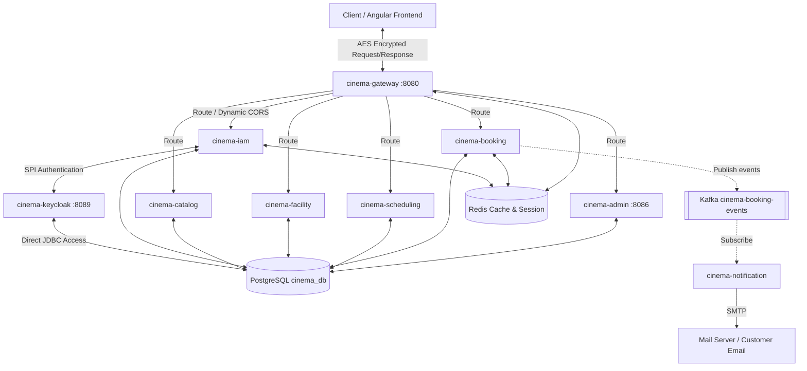
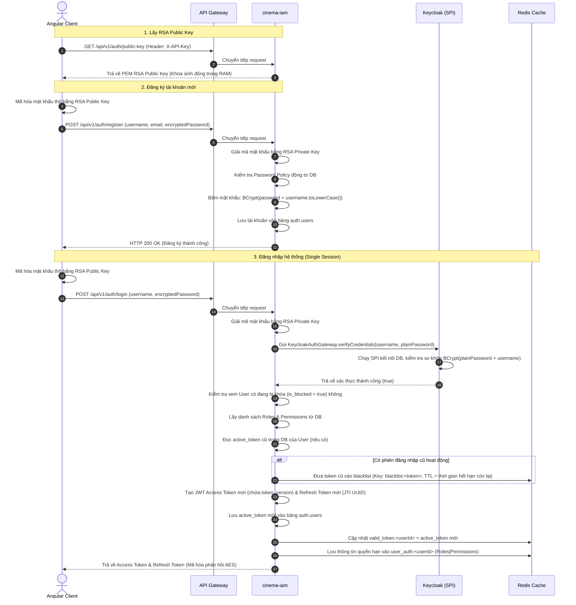
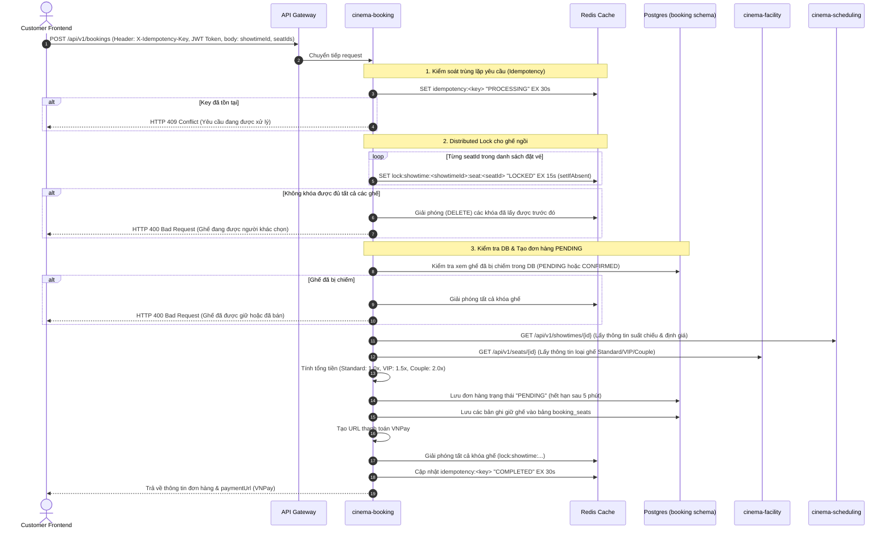
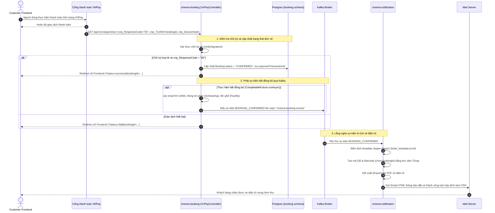
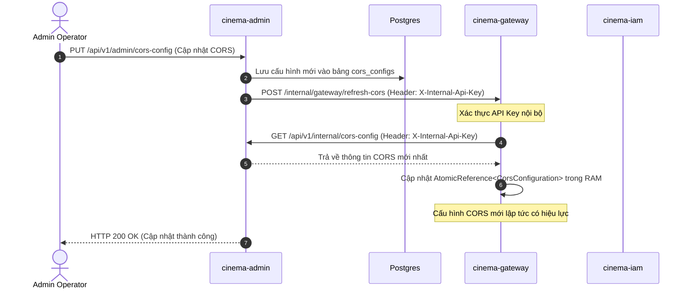

# Cinema System - Tổng quan Công nghệ, Quy trình Nghiệp vụ & Ràng buộc Kỹ thuật

Tài liệu này cung cấp cái nhìn toàn diện về bối cảnh công nghệ, kiến trúc Hexagonal, các quy trình nghiệp vụ cốt lõi, ràng buộc lập trình chi tiết và định hướng phát triển của dự án Quản lý Hệ thống Rạp chiếu phim (Cinema System).

---

## 1. Tổng quan Kiến trúc Hệ thống (System Architecture Overview)

Hệ thống Cinema được thiết kế dưới dạng tập hợp các **Microservices** độc lập, trao đổi với nhau thông qua HTTP REST (sử dụng Feign Clients) và các sự kiện bất đồng bộ qua **Kafka**. Cơ sở dữ liệu sử dụng **PostgreSQL** phân chia theo schema logic riêng biệt và bộ nhớ đệm **Redis** phục vụ quản lý phiên, khóa phân tán và bộ nhớ đệm phân quyền.

### Các thành phần chính trong hệ thống:
1.  **[cinema-gateway](file:///d:/sys_cinemas/cinema-microservices/cinema-gateway)** (Port `8080`): API Gateway định tuyến tất cả các yêu cầu từ Client, thực hiện kiểm soát CORS động, xác thực Client Key bảo vệ API Public, sinh và truyền `X-Request-Id` phục vụ tracing log.
2.  **[cinema-iam](file:///d:/sys_cinemas/cinema-microservices/cinema-iam)**: Quản lý danh tính và phân quyền (Identity & Access Management). Phối hợp với Keycloak để xác thực thông tin đăng nhập, sinh khoá RSA động trong bộ nhớ RAM, cấp phát Access Token & Refresh Token, thực hiện chính sách phiên làm việc duy nhất (Single Session) thông qua Redis.
3.  **[cinema-catalog](file:///d:/sys_cinemas/cinema-microservices/cinema-catalog)**: Quản lý danh mục phim (Movies), phim nổi bật (Featured Movies), và các banner quảng cáo động (Banners).
4.  **[cinema-facility](file:///d:/sys_cinemas/cinema-microservices/cinema-facility)**: Quản lý hạ tầng rạp bao gồm phòng chiếu (Rooms) và sơ đồ ghế ngồi (Seats) của từng phòng (loại ghế Standard, VIP, Couple).
5.  **[cinema-scheduling](file:///d:/sys_cinemas/cinema-microservices/cinema-scheduling)**: Quản lý lịch chiếu/suất chiếu (Showtimes) của phim tại các phòng chiếu, kèm theo định giá vé cơ sở cho từng suất chiếu.
6.  **[cinema-booking](file:///d:/sys_cinemas/cinema-microservices/cinema-booking)**: Xử lý quy trình đặt vé (Bookings), giữ ghế tạm thời (Booking Seats), tạo URL giao dịch VNPay, nhận callback thanh toán và xác nhận đơn hàng thành công, đẩy sự kiện xác nhận lên Kafka.
7.  **[cinema-admin](file:///d:/sys_cinemas/cinema-microservices/cinema-admin)** (Port `8086`): Cung cấp các APIs quản trị (CRUD Phim, Suất chiếu, Phòng, Ghế), quản lý các phiên làm việc đang hoạt động của người dùng, thay đổi chính sách bảo mật (Password Policy, Security Config, CORS Config). Ngoài ra hỗ trợ xuất báo cáo doanh thu PDF bằng JasperReports.
8.  **[cinema-notification](file:///d:/sys_cinemas/cinema-microservices/cinema-notification)**: Lắng nghe sự kiện xác nhận đặt vé từ Kafka để tự động kết xuất file PDF vé điện tử (chứa QR Code, Barcode) qua JasperReports và gửi email thông báo cho khách hàng.
9.  **[cinema-common](file:///d:/sys_cinemas/cinema-microservices/cinema-common)**: Thư viện dùng chung chứa các bộ lọc bảo mật dùng cho Microservices (giải mã AES request body, mã hóa response body, xác thực ApiKey nội bộ), xử lý ngoại lệ tập trung (`GlobalExceptionHandler`), cấu hình Spring Security cơ bản và các utilities dùng chung.
10. **[cinema-keycloak-spi](file:///d:/sys_cinemas/cinema-keycloak-spi)**: Custom SPI cho Keycloak (`CinemaUserStorageProvider`) giúp Keycloak có thể đọc trực tiếp cơ sở dữ liệu Postgres của ứng dụng Cinema (`auth.users`) và xác thực mật khẩu được băm theo chuẩn BCrypt có chứa muối là username.
11. **[cinema-frontend](file:///d:/sys_cinemas/cinema-frontend)**: Ứng dụng client viết bằng Angular 17+. Tích hợp cơ chế mã hoá AES tự động cho request body (`cryptoInterceptor`) và đính kèm JWT Token/API Key phù hợp (`authInterceptor`).

---

## 2. Quy trình & Luồng xử lý Logic Nghiệp vụ Chi tiết (Detailed Business Flows)

### 2.1. Luồng Xác thực (Authentication) & Bảo mật Phiên làm việc (Session Security)

Hệ thống tích hợp quy trình bảo mật nhiều lớp kết hợp giữa mã hoá RSA trên đường truyền, xác thực trung gian Keycloak SPI, và quản lý trạng thái phiên duy nhất qua Redis.

1.  **Lấy Khóa Công khai RSA (RSA Public Key Retrieval)**:
    - Khi Client khởi động trang Đăng nhập/Đăng ký, Client thực hiện gọi `GET /api/v1/auth/public-key`.
    - API Gateway kiểm tra header `X-Client-Key` / `X-API-Key` thông qua [ClientSecurityGuardFilter](file:///d:/sys_cinemas/cinema-microservices/cinema-gateway/src/main/java/com/example/cinema/gateway/filter/ClientSecurityGuardFilter.java). Nếu hợp lệ, Gateway chuyển tiếp yêu cầu đến `cinema-iam`.
    - `cinema-iam` trả về Public Key RSA dưới định dạng PEM. Khoá này được tạo ngẫu nhiên trong bộ nhớ của [RsaCryptoServiceImpl](file:///d:/sys_cinemas/cinema-microservices/cinema-common/src/main/java/com/example/cinema/common/security/RsaCryptoServiceImpl.java) khi service khởi chạy.
2.  **Đăng ký tài khoản (Register)**:
    - Người dùng điền thông tin đăng ký. Client dùng Public Key RSA nhận được để mã hóa mật khẩu thô và gửi yêu cầu `POST /api/v1/auth/register`.
    - `cinema-iam` giải mã mật khẩu bằng Private Key RSA nội bộ.
    - Truy vấn chính sách mật khẩu hiện tại trong bảng `password_policies` (id là `default-policy`), thực hiện kiểm tra độ dài tối thiểu, sự hiện diện của chữ hoa, chữ thường, chữ số và ký tự đặc biệt.
    - Nếu hợp lệ, hệ thống tạo bản ghi người dùng mới. Mật khẩu được băm và lưu vào DB theo quy tắc:
      `password = passwordEncoder.encode(plainPassword + request.getUsername().toLowerCase())`
3.  **Đăng nhập (Login)**:
    - Người dùng gửi yêu cầu đăng nhập chứa `username` và `password` đã được mã hóa RSA qua endpoint `POST /api/v1/auth/login`.
    - `cinema-iam` thực hiện giải mã mật khẩu bằng Private Key RSA của mình.
    - Gọi `KeycloakAuthGateway` gửi yêu cầu xác thực sang Keycloak. Keycloak sử dụng [CinemaUserStorageProvider](file:///d:/sys_cinemas/cinema-keycloak-spi/src/main/java/com/example/cinema/spi/CinemaUserStorageProvider.java) thực hiện kết nối trực tiếp DB Postgres, truy vấn bản ghi tương ứng trong schema `auth` và kiểm tra mật khẩu:
      `BCrypt.checkpw(rawPassword + user.getUsername(), hashedPassword)`
    - Sau khi Keycloak xác nhận hợp lệ, `cinema-iam` kiểm tra xem tài khoản có bị khóa không (`is_blocked = true`).
    - Lấy thông tin quyền hạn của người dùng từ cơ sở dữ liệu để tạo JWT Access Token (claims: `userId`, `username`, `roles`, `permissions`, `tokenVersion`) và Refresh Token (dạng UUID JTI lưu trong DB).
4.  **Kiểm soát Phiên làm việc Duy nhất (Single Session Enforcement)**:
    - Trước khi lưu Access Token mới, [AuthServiceImpl](file:///d:/sys_cinemas/cinema-microservices/cinema-iam/src/main/java/com/example/cinema/iam/application/usecases/AuthServiceImpl.java) kiểm tra xem tài khoản đã có token hoạt động trước đó chưa (`user.getActiveToken()`).
    - Nếu có, token cũ sẽ được đưa vào **Redis Blacklist** với key `blacklist:<token>` và TTL bằng thời gian hết hạn còn lại của token đó.
    - Cập nhật `active_token` mới vào bảng `auth.users`, đồng thời ghi đè giá trị vào Redis với key `valid_token:<userId>`.
    - Mọi request gửi lên đều đi qua [JwtAuthenticationFilter](file:///d:/sys_cinemas/cinema-microservices/cinema-common/src/main/java/com/example/cinema/common/security/JwtAuthenticationFilter.java). Filter thực hiện:
      - Kiểm tra sự tồn tại của token trong Redis Blacklist -> Nếu có, ném lỗi token đã bị thu hồi.
      - So khớp token hiện tại với giá trị active lưu tại `valid_token:<userId>` -> Nếu không khớp (do tài khoản vừa đăng nhập ở thiết bị khác), ném lỗi `AuthException.sessionInvalidated()` và trả về mã lỗi `401 Unauthorized` buộc client phải đăng xuất.
5.  **Thu hồi & Chống Tái sử dụng Refresh Token (Refresh Token Rotation & Intrusion Detection)**:
    - Khi client gọi `POST /api/v1/auth/refresh-token` gửi kèm Refresh Token JTI.
    - Hệ thống tìm token trong bảng `auth_tokens`. Nếu token không hoạt động (`is_active = false`) hoặc đã hết hạn: hệ thống nghi ngờ có sự xâm nhập/tái sử dụng token trái phép. Lập tức **thu hồi tất cả các phiên đăng nhập hiện tại** của người dùng đó (`tokenRepository.revokeAllByUserId(userId)`) và ném lỗi xác thực.
    - Nếu hợp lệ, hệ thống thực hiện cơ chế xoay vòng Refresh Token (hủy token cũ, sinh cặp Access Token & Refresh Token mới).

---

### 2.2. Luồng Đặt vé & Giữ ghế (Seat Booking & Hold Flow)

Luồng đặt vé được thiết kế để đảm bảo không xảy ra hiện tượng đặt trùng ghế (Double Booking) ngay cả khi hàng ngàn người dùng cùng tranh chấp một số lượng ghế giới hạn tại cùng một thời điểm.

1.  **Chống trùng lặp yêu cầu (Idempotency Filter)**:
    - Khi Client gửi request đặt vé (`POST /api/v1/bookings`), bộ lọc [IdempotencyFilter](file:///d:/sys_cinemas/cinema-microservices/cinema-common/src/main/java/com/example/cinema/common/filter/IdempotencyFilter.java) đánh giá header `X-Idempotency-Key`.
    - Thực hiện gọi Redis `setIfAbsent("idempotency:" + key, "PROCESSING", 30s)`. Nếu khóa đã tồn tại, lập tức chặn request và trả về `409 Conflict` yêu cầu người dùng chờ đợi.
2.  **Khóa Phân tán Ghế ngồi (Redis Distributed Lock)**:
    - Trong [BookingServiceImpl](file:///d:/sys_cinemas/cinema-microservices/cinema-booking/src/main/java/com/example/cinema/booking/application/usecases/BookingServiceImpl.java), trước khi thực hiện bất kỳ truy vấn hay ghi DB nào, hệ thống thực hiện vòng lặp khoá các ghế được yêu cầu trong Redis.
    - Key format: `lock:showtime:<showtimeId>:seat:<seatId>` với TTL là 15 giây.
    - Nếu có bất cứ ghế nào khóa thất bại (do có người dùng khác đang đồng thời đặt ghế đó), hệ thống lập tức **hủy tất cả các khóa đã lấy được thành công trước đó** và ném lỗi `ClientException` báo ghế đang được xử lý bởi người khác.
3.  **Xác thực trạng thái ghế vật lý trong DB**:
    - Hệ thống kiểm tra trong bảng `booking.booking_seats` kết hợp với bảng `booking.bookings` xem có bản ghi nào chứa cặp `(seat_id, showtime_id)` đang ở trạng thái `PENDING` hoặc `CONFIRMED` hay không.
    - Nếu có, lập tức giải phóng khóa và trả về lỗi thông báo ghế đã được giữ chỗ hoặc đã bán.
4.  **Tính toán giá vé & Tạo đơn đặt vé PENDING**:
    - Gọi sang `cinema-scheduling` và `cinema-facility` để lấy thông tin suất chiếu và loại ghế (Standard, VIP, Couple).
    - Tính toán giá tiền thực tế của từng ghế dựa trên hệ số nhân loại ghế:
      - **VIP**: Bằng giá VIP của suất chiếu hoặc fallback = giá gốc suất chiếu * 1.5.
      - **COUPLE**: Bằng giá Couple của suất chiếu hoặc fallback = giá gốc suất chiếu * 2.0.
      - **STANDARD**: Bằng giá gốc suất chiếu.
    - Tạo đơn đặt vé mới trong bảng `booking.bookings` với trạng thái `PENDING` và thiết lập thời gian hết hạn thanh toán `expires_at` là **5 phút** kể từ thời điểm tạo. Lưu các ghế giữ chỗ vào bảng `booking.booking_seats`.
    - Giải phóng toàn bộ các khóa ghế trên Redis trong khối lệnh `finally` (chỉ chạy sau khi Transaction của cơ sở dữ liệu đã được commit hoàn tất).
5.  **Dọn dẹp ghế giữ chỗ quá hạn (Cleanup Pending Bookings Job)**:
    - Một tác vụ định kỳ chạy mỗi phút [BookingCleanupScheduler](file:///d:/sys_cinemas/cinema-microservices/cinema-booking/src/main/java/com/example/cinema/booking/infrastructure/scheduler/BookingCleanupScheduler.java) quét cơ sở dữ liệu tìm các đơn hàng có trạng thái `PENDING` và `expires_at < LocalDateTime.now()`.
    - Chuyển trạng thái đơn đặt vé thành `EXPIRED`.
    - Thực hiện xóa các bản ghi ghế giữ chỗ liên quan trong bảng `booking.booking_seats` (giải phóng ghế về trạng thái trống).

---

### 2.3. Luồng Thanh toán VNPay & Hoàn tất Đơn đặt vé (Payment & Confirmation Flow)

1.  **Nhận Callback Giao dịch (VNPay Callback Handler)**:
    - VNPay gửi yêu cầu redirect trình duyệt của người dùng về endpoint công khai `GET /api/v1/vnpay/return` (bỏ qua bộ lọc JWT).
    - [VnPayController](file:///d:/sys_cinemas/cinema-microservices/cinema-booking/src/main/java/com/example/cinema/booking/presentation/controllers/VnPayController.java) nhận thông tin, thực hiện kiểm tra mã băm bảo mật chữ ký số (`verifySignature`).
    - Nếu chữ ký hợp lệ và `vnp_ResponseCode` bằng `"00"` (giao dịch thành công), hệ thống cập nhật trạng thái đơn đặt vé thành `CONFIRMED` và điền thông tin mã giao dịch `payment_transaction_id` của VNPay.
    - Chuyển hướng người dùng về trang kết quả đặt vé trên frontend: `?status=success&bookingId=<bookingId>`. Nếu thất bại, chuyển hướng kèm `status=fail`.
2.  **Thu thập thông tin & Phát hành sự kiện Kafka**:
    - Sau khi cập nhật trạng thái đơn hàng thành công, hệ thống sử dụng `CompletableFuture.runAsync` bất đồng bộ để thực hiện gọi liên dịch vụ (inter-service calls):
      - Gọi `cinema-iam` lấy địa chỉ Email của khách hàng.
      - Gọi `cinema-scheduling` lấy tên phim chiếu, tên phòng chiếu, thời gian bắt đầu.
      - Gọi `cinema-facility` lấy nhãn hiển thị của các ghế đã đặt (ví dụ: `H10`, `H11`).
    - Tạo Payload sự kiện `BookingConfirmedPayload` và đẩy lên Kafka topic `"cinema-booking-events"` thông qua `BookingEventPublisher`.
3.  **Kết xuất vé PDF & Gửi Email khách hàng**:
    - Service `cinema-notification` lắng nghe topic `"cinema-booking-events"`.
    - Khi nhận được sự kiện `BOOKING_CONFIRMED`, [BookingConfirmedListener](file:///d:/sys_cinemas/cinema-microservices/cinema-notification/src/main/java/com/example/cinema/notification/listener/BookingConfirmedListener.java) gọi [TicketPdfGenerator](file:///d:/sys_cinemas/cinema-microservices/cinema-notification/src/main/java/com/example/cinema/notification/service/TicketPdfGenerator.java).
    - Dịch vụ sinh ảnh QR code (chứa chuỗi dữ liệu check-in) và ảnh Barcode CODE-128 (chứa mã đơn đặt vé) bằng thư viện ZXing.
    - Biên dịch tệp template báo cáo Jasper (`ticket_template.jrxml`), truyền các tham số (tên phim, suất chiếu, phòng chiếu, danh sách ghế, tổng tiền, luồng dữ liệu ảnh QR code/Barcode) và kết xuất thành mảng byte PDF.
    - Soạn thảo email HTML và đính kèm tệp PDF vé điện tử để gửi đến khách hàng thông qua JavaMailSender.

---

### 2.4. Luồng Cấu hình Động & Webhook đồng bộ (Dynamic Configs & Webhook Sync)

Hệ thống hỗ trợ thay đổi cấu hình CORS, danh sách đường dẫn cần bảo vệ hoặc bypass và chính sách bảo mật động tại Runtime mà không cần khởi động lại API Gateway:

1.  **Cập nhật cấu hình**:
    - Quản trị viên gọi API `PUT /api/v1/admin/cors-config` hoặc `PUT /api/v1/admin/security-config` để thay đổi chính sách CORS hoặc danh sách đường dẫn bảo vệ.
    - Dữ liệu được lưu trữ trực tiếp vào cơ sở dữ liệu Postgres.
2.  **Kích hoạt Webhook đồng bộ**:
    - Service Admin thực hiện gửi một yêu cầu `POST /internal/gateway/refresh-cors` hoặc `POST /internal/gateway/refresh-security` sang API Gateway. Yêu cầu này bắt buộc đính kèm header `X-Internal-Api-Key` khớp với cấu hình hệ thống.
3.  **Gateway nạp nóng cấu hình (Hot Reload)**:
    - [GatewayInternalController](file:///d:/sys_cinemas/cinema-microservices/cinema-gateway/src/main/java/com/example/cinema/gateway/filter/GatewayInternalController.java) xác thực API Key nội bộ, sau đó kích hoạt tải lại cấu hình tương ứng.
    - Gọi bất đồng bộ ngược lại Admin Service qua endpoint nội bộ `/api/v1/internal/cors-config` hoặc `/api/v1/internal/security-config` để lấy dữ liệu mới nhất.
    - Cập nhật các biến cấu hình lưu trữ trong bộ nhớ RAM (`AtomicReference`). Mọi request tiếp theo đi qua API Gateway lập tức được áp dụng cấu hình mới.

---

## 3. Các Ràng buộc khi Lập trình & Quy định Code (Coding Constraints & Guidelines)

Để đảm bảo tính nhất quán của mã nguồn, độ ổn định của hệ thống phân tán và tính bảo mật cao, tất cả các thay đổi mã nguồn hoặc các tính năng mới bắt buộc phải tuân thủ các quy tắc sau:

### 3.1. Ràng buộc về Kiến trúc & Thiết kế (Architectural Rules)
-   **Kiến trúc Lục giác (Hexagonal Architecture / Clean Architecture)**:
    -   Cấu trúc của các Microservices phải chia rõ rệt thành 4 tầng riêng biệt:
        1.  `domain`: Chứa thực thể nghiệp vụ thuần túy (Entities), logic nghiệp vụ nội tại và khai báo interfaces của repository. **Tuyệt đối không sử dụng các annotation của Spring hoặc JPA (như @Entity, @Table, @Autowired) trong tầng này.**
        2.  `application`: Chứa các ca sử dụng (Use Cases), cổng giao tiếp (Ports) và DTOs.
        3.  `infrastructure`: Chứa triển khai của các cổng giao tiếp (Database Adapters, Redis, external integrations, configurations).
        4.  `presentation`: Chứa các REST Controllers và trình quản lý ngoại lệ (`GlobalExceptionHandler`).
    -   **Mô hình Port - Adapter**: Mọi Service nghiệp vụ phải được thiết kế theo cặp **Interface - Implementation** (ví dụ: port `BookingService` và triển khai `BookingServiceImpl`).
    -   **Chuyển đổi DTO**: Không được phép trả về trực tiếp thực thể cơ sở dữ liệu (JPA Entity) lên Presentation. Phải map qua lớp DTO bằng Object Mapper (`ModelMapper` hoặc `MapStruct`).

### 3.2. Ràng buộc về Cơ sở Dữ liệu & Xử lý Dữ liệu (Database Constraints)
-   **Schema riêng biệt**: Phải sử dụng các schema độc lập đã được thiết lập sẵn trong PostgreSQL (`auth`, `catalog`, `facility`, `scheduling`, `booking`, `keycloak`). Không lưu trữ dữ liệu vào schema mặc định `public`.
-   **Xóa mềm bắt buộc (Standardized Soft Delete)**:
    -   Tất cả các bảng chính chứa thông tin nghiệp vụ đều phải triển khai cơ chế xóa mềm:
        -   Bắt buộc có cột `is_deleted` kiểu `BOOLEAN` với thuộc tính `NOT NULL DEFAULT FALSE`.
        -   Mọi câu lệnh SELECT, JOIN dữ liệu hoặc tính toán doanh thu đều bắt buộc phải kèm theo điều kiện lọc `is_deleted = false`.
-   **Ràng buộc Duy nhất Ghế & Suất chiếu**:
    -   Tại bảng `booking.booking_seats`, bắt buộc khai báo constraint `uk_seat_showtime UNIQUE (seat_id, showtime_id)`. Điều này ngăn chặn triệt để tình trạng hai đơn hàng khác nhau cố tình ghi đè đặt cùng một ghế trên một suất chiếu ở mức vật lý (DB Level).

### 3.3. Ràng buộc về Bảo mật & Mã hóa (Security Constraints)
-   **Mã hoá Giao tiếp Client - Server (End-to-End Encryption)**:
    -   **Payload Request (Body)**: Client (Frontend Angular) bắt buộc phải mã hoá toàn bộ body của các request `POST`, `PUT`, `PATCH` (ngoại trừ các API được loại trừ như VNPay callback) bằng thuật toán AES sử dụng khoá bảo mật `cryptoKey` cấu hình từ `.env`. Dữ liệu gửi đi dưới dạng: `{ "payload": "<AES_Base64>" }`. Phía Backend giải mã tự động thông qua `AesDecryptionFilter` trước khi chuyển giao dữ liệu vào Controller.
    -   **Payload Response**: Phản hồi từ backend cũng được mã hóa tương tự và trả về dưới dạng JSON bọc `{ "payload": "<AES_Base64>" }` nếu có cấu hình bật mã hóa response toàn cục hoặc request gửi kèm header `X-Response-Encrypt: true`.
    -   **Mã hoá thông tin đăng nhập**: Mật khẩu khi gửi từ client bắt buộc phải được mã hóa bằng khóa công khai RSA (`RSA/ECB/PKCS5Padding`). Phía server dùng khoá bí mật RSA tạo động trong RAM để giải mã mật khẩu thô trước khi kiểm tra với Keycloak.
-   **Xác thực API Key**:
    -   **Request ngoài vào (Public APIs qua Gateway)**: Bắt buộc phải mang header `X-Client-Key` hoặc `X-API-Key` khớp với khoá bảo mật hệ thống để ngăn chặn việc dò quét API trực tiếp vào các cổng public nhạy cảm.
    -   **Giao tiếp nội bộ (Inter-service Communication)**: Các cuộc gọi trực tiếp giữa các service thông qua Feign Client hoặc gọi endpoint `/api/v1/internal/**` bắt buộc phải mang theo header `X-Internal-Api-Key` khớp với biến môi trường `app.security.internal-api-key`.
-   **Chính sách mật khẩu**:
    -   Mật khẩu đăng ký mới bắt buộc phải đi qua validation kiểm tra độ mạnh dựa trên chính sách mật khẩu lưu động trong bảng `password_policies` (độ dài tối thiểu, chữ hoa, chữ thường, số, ký tự đặc biệt).

### 3.4. Ràng buộc về Đồng nhất & Giao tác (Transactions & Consistency)
-   **Múi giờ đồng nhất**:
    -   Toàn bộ hệ thống (JVM, Docker Containers, PostgreSQL, Redis) bắt buộc phải đồng bộ múi giờ Việt Nam: `Asia/Ho_Chi_Minh`. Mọi thao tác lưu trữ thời gian đều sử dụng kiểu dữ liệu timestamp phù hợp (Timestamp with timezone).
-   **Phân bổ giao dịch (Transaction Boundaries)**:
    -   Mọi thao tác ghi DB, cập nhật đơn hàng, thanh toán phải được bọc trong `@Transactional` ở lớp Service của Spring.
    -   Đảm bảo giải phóng Redis Lock sau khi transaction đã thực sự `COMMIT` thành công (bọc lock release trong khối `finally` bên ngoài method gọi transaction helper).

### 3.5. Quy định về Ghi log (Logging Standards)
-   **Trace logs toàn hệ thống**:
    -   API Gateway tự động sinh hoặc kế thừa header `X-Request-Id` (hoặc `x-correlation-id`) dưới dạng mã UUID ngắn (8 ký tự đầu).
    -   ID này được truyền qua toàn bộ luồng xử lý của các microservices thông qua HTTP Header và đưa vào MDC log. Mọi dòng log được in ra phải đi kèm Request ID để phục vụ việc truy vết sự cố giữa các microservice.
-   **Ẩn thông tin nhạy cảm**:
    -   Tuyệt đối không in mật khẩu thô, mã PIN, mã hash thẻ, JWT token hoặc thông tin cá nhân nhạy cảm của khách hàng ra màn hình console hay file log. Cần thực hiện mask dữ liệu nhạy cảm (ví dụ: `us***`).
-   **Ghi nhận hiệu năng**:
    -   Ghi nhận chi tiết thời gian phản hồi (Response Time in milliseconds) của mỗi API tại Gateway và các bộ lọc filter nghiệp vụ.

---

## 4. Hướng đi & Chiến lược Phát triển Hệ thống (System Roadmap)

Để nâng cấp hệ thống đạt tiêu chuẩn vận hành sản phẩm (Production-ready) trong môi trường phân tán thực tế, các hướng đi kỹ thuật cần triển khai bao gồm:

1.  **Lưu trữ RSA KeyPair Bền vững (Persistent RSA Key Storage)**:
    -   *Hiện trạng*: RSA KeyPair đang sinh ngẫu nhiên trên RAM của `cinema-iam` mỗi khi start. Khi nhân bản nhiều instance IAM (Scale-out) phía sau Gateway, các instance khác nhau sẽ có cặp khóa khác nhau dẫn đến lỗi giải mã.
    -   *Hướng giải quyết*: Lưu trữ RSA KeyPair cố định vào hệ quản trị cấu hình bảo mật như **HashiCorp Vault**, hoặc lưu bản mã hoá khóa bí mật vào DB, đảm bảo các instance IAM luôn đồng bộ khóa với nhau.
2.  **Khử Độc lập Lỗi & Tích hợp Cô lập lỗi (Circuit Breaker)**:
    -   *Hiện trạng*: Các cuộc gọi Feign Client từ `cinema-booking` sang `cinema-scheduling` và `cinema-facility` đang chạy đồng bộ trực tiếp. Nếu các service này gặp sự cố, hệ thống đặt vé sẽ bị treo.
    -   *Hướng giải quyết*: Triển khai **Resilience4j Circuit Breaker** tại Feign Clients để tự động ngắt kết nối khi quá tải và kích hoạt các phương án dự phòng (fallback) hoặc nạp cache khi service đích ngừng hoạt động.
3.  **Tối ưu hóa Khóa phân tán Ghế ngồi (Lock Optimization)**:
    -   *Hiện trạng*: Khóa phân tán tự chế bằng `StringRedisTemplate` chưa hỗ trợ tự động gia hạn khóa nếu luồng xử lý DB bị nghẽn quá thời hạn lock (15s), hoặc chưa tối ưu luồng giải phóng khóa chủ động.
    -   *Hướng giải quyết*: Thay thế bằng thư viện chuyên dụng **Redisson**, sử dụng cơ chế khóa có giám sát (Watchdog) để gia hạn khóa tự động và đảm bảo giải phóng khóa ngay khi Transaction hoàn tất.
4.  **Tích hợp Cơ chế Đối soát VNPay tự động (Transaction Reconciliation)**:
    -   *Hiện trạng*: Nếu cuộc gọi callback VNPay bị rớt do lỗi mạng, trạng thái đơn đặt vé sẽ bị kẹt ở `PENDING` và bị huỷ bởi Scheduler sau 5 phút dù khách hàng đã bị trừ tiền.
    -   *Hướng giải quyết*: Viết thêm một Scheduled Job thực hiện truy vấn đối soát tự động cuối ngày (gọi API QueryDR của VNPay) cho các đơn hàng `PENDING` hoặc `EXPIRED` để kiểm tra trạng thái thanh toán thực tế bên phía ngân hàng, tự động cập nhật lại trạng thái đơn hàng để bảo vệ quyền lợi của khách hàng.
5.  **Tối ưu hóa Bộ nhớ đệm Danh mục (Catalog Caching)**:
    -   *Hiện trạng*: Khách hàng xem danh sách phim và lịch chiếu liên tục, gây sức ép truy vấn lớn lên DB Postgres.
    -   *Hướng giải quyết*: Áp dụng Cache-aside pattern với Redis cho `cinema-catalog` và `cinema-scheduling`. Đặt cơ chế tự động thu hồi (eviction/invalidate) cache thông qua sự kiện khi admin chỉnh sửa hoặc thêm phim mới.
