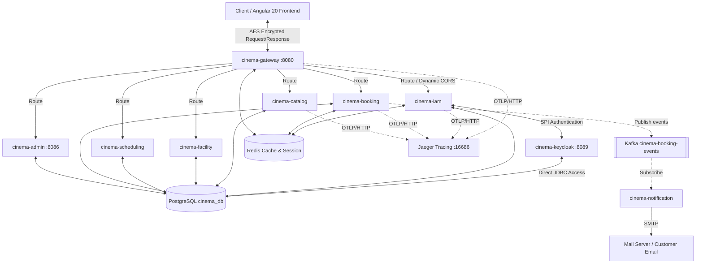
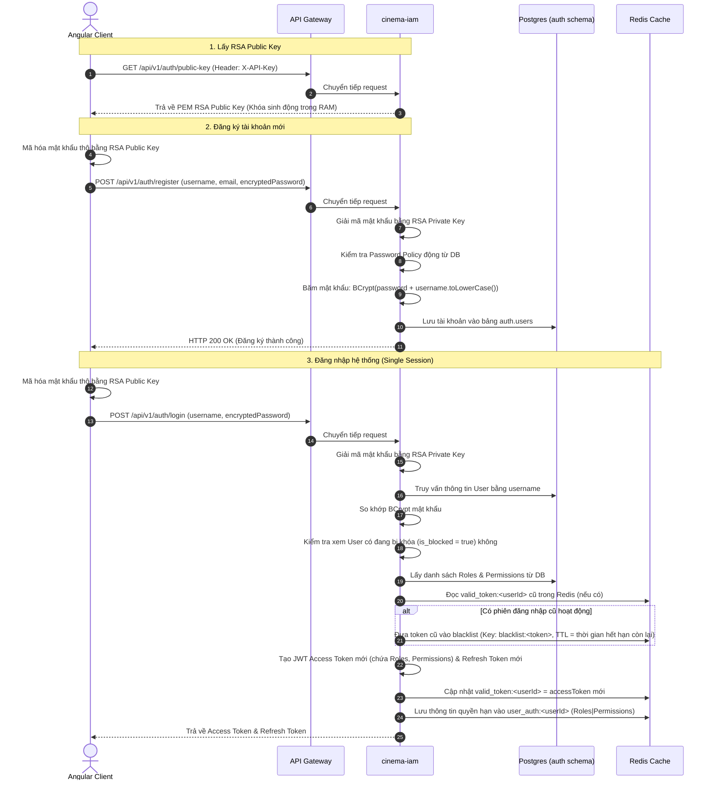
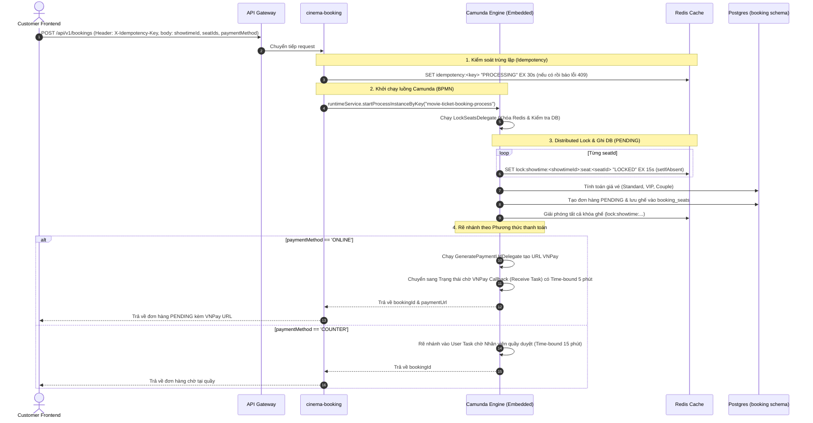
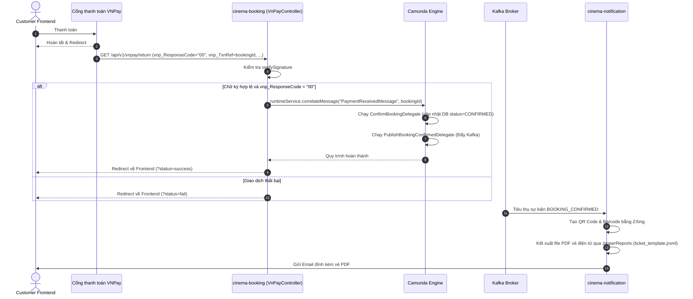

# Cinema System - Tổng quan Công nghệ, Quy trình Nghiệp vụ & Ràng buộc Kỹ thuật

Tài liệu này cung cấp cái nhìn toàn diện về bối cảnh công nghệ, kiến trúc Hexagonal, các quy trình nghiệp vụ cốt lõi, ràng buộc lập trình chi tiết và định hướng phát triển của dự án Quản lý Hệ thống Rạp chiếu phim (Cinema System).

---

## 1. Tổng quan Kiến trúc Hệ thống (System Architecture Overview)

Hệ thống Cinema được thiết kế dưới dạng tập hợp các **Microservices** độc lập (Spring Boot 3.2.4, Java 17), trao đổi với nhau thông qua HTTP REST (sử dụng Feign Clients) và các sự kiện bất đồng bộ qua **Kafka**. Cơ sở dữ liệu sử dụng **PostgreSQL 16** phân chia theo schema logic riêng biệt và bộ nhớ đệm **Redis 7** phục vụ quản lý phiên, khóa phân tán và bộ nhớ đệm phân quyền. Ứng dụng tích hợp công cụ theo dõi phân tán (Distributed Tracing) thông qua **Spring Boot 3 Micrometer Tracing**, **OpenTelemetry (OTLP)** và **Jaeger**.

Ở lớp frontend, hệ thống sử dụng **Angular 20.3** kết hợp **TailwindCSS 3.4**, **Angular Material**, và **Ng-Zorro-Antd** để cung cấp giao diện người dùng hiện đại, quản lý trạng thái bằng **RxJS** và biểu đồ thống kê bằng **Chart.js**.

### Các thành phần chính trong hệ thống:
1.  **cinema-gateway** (Port `8080`): API Gateway định tuyến tất cả các yêu cầu từ Client, thực hiện kiểm soát CORS động, xác thực Client Key bảo vệ API Public. Đóng vai trò là điểm khởi tạo W3C Trace Context để truyền xuyên suốt các microservice.
2.  **cinema-iam**: Quản lý danh tính và phân quyền (Identity & Access Management). Trực tiếp quản lý xác thực bằng cơ sở dữ liệu nội bộ, sinh khoá RSA động trong bộ nhớ RAM để bảo mật mật khẩu, cấp phát Access Token & Refresh Token, thực hiện chính sách phiên làm việc duy nhất (Single Session) thông qua Redis. Có cung cấp Endpoint API SSO để tích hợp tuỳ chọn với Keycloak.
3.  **cinema-catalog**: Quản lý danh mục phim (Movies), phim nổi bật (Featured Movies), và các banner quảng cáo động (Banners).
4.  **cinema-facility**: Quản lý hạ tầng rạp bao gồm phòng chiếu (Rooms) và sơ đồ ghế ngồi (Seats) của từng phòng (loại ghế Standard, VIP, Couple).
5.  **cinema-scheduling**: Quản lý lịch chiếu/suất chiếu (Showtimes) của phim tại các phòng chiếu, kèm theo định giá vé cơ sở cho từng suất chiếu.
6.  **cinema-booking**: Xử lý quy trình đặt vé, giữ ghế tạm thời, và quản lý hoàn tiền. **Điểm đặc biệt:** Microservice này nhúng **Camunda BPM Engine** để áp dụng pattern **Saga (Process Orchestration)** cho các giao dịch phân tán, tự động hóa quy trình thanh toán VNPay và quy trình phê duyệt thủ công.
7.  **cinema-admin** (Port `8086`): Cung cấp các APIs quản trị (CRUD Phim, Suất chiếu, Phòng, Ghế), quản lý các phiên làm việc đang hoạt động của người dùng, thay đổi chính sách bảo mật động. Tích hợp **JasperReports** để xuất các báo cáo thống kê, doanh thu dưới dạng PDF.
8.  **cinema-notification**: Lắng nghe sự kiện xác nhận đặt vé từ Kafka để tự động kết xuất file PDF vé điện tử (chứa QR Code, Barcode cấu hình bằng ZXing và **JasperReports**) và gửi email thông báo cho khách hàng qua thư viện JavaMail.
9.  **cinema-common**: Thư viện dùng chung chứa các bộ lọc bảo mật (giải mã AES request body, mã hóa response body, xác thực ApiKey nội bộ), xử lý ngoại lệ tập trung (`GlobalExceptionHandler`), cấu hình Spring Security cơ bản và các utilities dùng chung.
10. **cinema-keycloak-spi**: Custom SPI cho Keycloak (`CinemaUserStorageProvider`) giúp Keycloak có thể đọc trực tiếp cơ sở dữ liệu Postgres của ứng dụng (`auth.users`) và xác thực mật khẩu được băm theo chuẩn BCrypt (có chứa muối là username).
11. **cinema-frontend**: Ứng dụng client viết bằng Angular 20.3. Tích hợp cơ chế mã hoá AES tự động cho request body (`cryptoInterceptor`), đính kèm JWT Token/API Key phù hợp (`authInterceptor`), tích hợp màn hình Tasklist tương tác trực tiếp với các tác vụ (User Tasks) của Camunda.

---

## 2. Quy trình & Luồng xử lý Logic Nghiệp vụ Chi tiết (Detailed Business Flows)

### 2.1. Luồng Xác thực (Authentication) & Bảo mật Phiên làm việc (Session Security)

Hệ thống tích hợp quy trình bảo mật nhiều lớp kết hợp giữa mã hoá RSA trên đường truyền, xác thực trung gian Keycloak SPI, và quản lý trạng thái phiên duy nhất qua Redis.

1.  **Lấy Khóa Công khai RSA**: Client gọi `GET /api/v1/auth/public-key`. API Gateway kiểm tra header `X-API-Key` qua `ClientSecurityGuardFilter`. Nếu hợp lệ, `cinema-iam` trả về Public Key RSA (được tạo ngẫu nhiên trong bộ nhớ bởi `RsaCryptoServiceImpl`).
2.  **Đăng ký tài khoản (Register)**: Client dùng Public Key RSA nhận được để mã hóa mật khẩu thô và gửi yêu cầu tạo tài khoản. Server giải mã bằng Private Key, băm BCrypt cùng muối và lưu DB.
3.  **Đăng nhập (Login)**: `cinema-iam` tự động truy vấn CSDL nội bộ và so khớp mật khẩu bằng BCrypt mà không đi qua Keycloak (để tối ưu tốc độ). Keycloak hiện chỉ đóng vai trò hỗ trợ luồng SSO tuỳ chọn.
4.  **Kiểm soát Phiên làm việc Duy nhất (Single Session)**: Trước khi lưu token mới, token cũ bị thu hồi vào **Redis Blacklist** và gỡ khỏi Redis `valid_token:<userId>`. Filter `JwtAuthenticationFilter` ngăn chặn việc sử dụng token đã bị thu hồi hoặc phiên đã được tạo mới ở nơi khác.

---

### 2.2. Luồng Đặt vé & Giữ ghế (Seat Booking & Orchestration by Camunda)

Quy trình đặt vé sử dụng Redis Distributed Lock để giải quyết bài toán chống trùng ghế (Double Booking) và áp dụng mô hình **Saga (Process Orchestration)** thông qua **Camunda BPM** để điều phối các bước thanh toán (sinh URL, chờ callback, hủy ghế nếu quá thời gian).

1.  **Chống trùng lặp yêu cầu (Idempotency Filter)**: Bộ lọc `IdempotencyFilter` đánh giá header `X-Idempotency-Key`, gọi Redis `setIfAbsent`. Tránh tình trạng mạng chập chờn click đúp.
2.  **Khởi tạo luồng Camunda**: Bộ điều khiển gọi `runtimeService.startProcessInstanceByKey`.
3.  **Khóa Phân tán Ghế ngồi (Redis Distributed Lock)**: Trong `LockSeatsDelegate`, hệ thống duyệt và khoá các ghế trên Redis. Nếu có khóa thất bại, hủy toàn bộ khóa đã có, trả về HTTP 400. Kế tiếp lưu thông tin vé (PENDING) xuống DB và giải phóng lock.
4.  **Điều phối thời gian chờ thanh toán (Timeout handling)**: Thay vì dùng cron job quét DB liên tục, Camunda gắn **Boundary Timer Event** (5 phút cho thanh toán online, 15 phút cho thanh toán tại quầy) vào task chờ. Khi quá hạn, luồng rẽ nhánh sang `CancelBookingDelegate` tự động chuyển vé thành EXPIRED và giải phóng ghế.

---

### 2.3. Luồng Thanh toán VNPay & Hoàn tất Đơn đặt vé

1.  **Callback từ VNPay**: `VnPayController` xác minh chữ ký hash VNPay. Nếu hợp lệ, Controller không tự cập nhật DB mà gửi **Message Correlation** vào Camunda (`PaymentReceivedMessage`) để tiếp tục luồng quy trình (đánh thức Receive Task đang bị chặn chờ thanh toán).
2.  **Phát sự kiện & JasperReports**: Khi vé được xác nhận, `PublishBookingConfirmedDelegate` lấy thêm thông tin phim, phòng, và gửi message qua **Kafka**. Service `cinema-notification` lắng nghe, tạo QR, nhúng vào template JasperReports `.jrxml`, xuất ra `.pdf` và gửi email.

---

### 2.4. Luồng Phê duyệt Hoàn vé thủ công & Duyệt tại quầy (User Tasks)

Sử dụng Camunda **User Tasks** kết hợp với **Angular Frontend Tasklist**:

1. **Khách hàng yêu cầu hoàn vé**: 
   - Khởi chạy một Camunda Process mới (`ticket-refund-process`).
   - Delegate tự động `CheckRefundEligibilityDelegate` sẽ kiểm tra (ví dụ: suất chiếu còn trên 24 giờ). Nếu đủ điều kiện, gọi tự động `RefundMoneyDelegate`.
   - Nếu không đủ điều kiện tự động, hệ thống rẽ nhánh sinh ra **User Task** chờ Admin phê duyệt.
2. **Dashboard Duyệt Vé (Angular)**:
   - Angular Admin Frontend gọi API `GET /api/v1/camunda/tasks/active?candidateGroup=ROLE_ADMIN`.
   - Nhân viên/Admin nhấp nút "Nhận việc" gọi `/claim` để gán Assignee.
   - Khi hoàn thành, gọi `/complete` với biến kết quả (`adminApproval: true/false`).
3. **Thực thi nghiệp vụ tự động**: 
   - Dựa vào kết quả trả về từ Angular, Camunda tiếp tục chạy `RefundMoneyDelegate` (Hoàn tiền VNPay API / Đổi vé) hoặc `RejectRefundDelegate` (Từ chối).

---

### 2.5. Luồng Cấu hình Động & Webhook đồng bộ (Dynamic Configs & Webhook Sync)

Hệ thống hỗ trợ thay đổi cấu hình CORS, danh sách đường dẫn cần bảo vệ hoặc bypass và chính sách bảo mật động tại Runtime mà không cần khởi động lại API Gateway hay các microservices:

-   **Cập nhật cấu hình**: Quản trị viên gọi các API quản trị như `PUT /api/v1/admin/cors-config` hoặc `PUT /api/v1/admin/security-config` trên `cinema-admin`.
-   **Đồng bộ Redis (Security Config)**: Khi cấu hình bảo mật hệ thống được cập nhật, Service Admin ghi các giá trị mới trực tiếp vào Redis:
    -   `security:client-key`: API Key dùng để bảo vệ các API Public dành riêng cho Client/Frontend.
    -   `security:bypass-paths`: Danh sách các API/đường dẫn được phép bỏ qua xác thực API Key. Các microservices backend (qua `ApiKeyFilter` trong `cinema-common`) sẽ tự động đọc trực tiếp từ Redis ở mỗi request, cho phép cập nhật bypass list tức thì.
-   **Kích hoạt Webhook đồng bộ sang API Gateway**: Service Admin gửi yêu cầu HTTP nội bộ (kèm Header `X-Internal-Api-Key`) sang API Gateway để yêu cầu nạp lại cấu hình:
    -   `POST /internal/gateway/refresh-cors`: Yêu cầu đồng bộ cấu hình CORS mới.
    -   `POST /internal/gateway/refresh-security`: Yêu cầu đồng bộ cấu hình API Key và các đường dẫn bảo vệ của Gateway.
-   **Gateway nạp nóng cấu hình (Hot Reload)**: `GatewayInternalController` xác nhận khoá API nội bộ hợp lệ, gọi ngược lại Admin Service qua WebClient để lấy dữ liệu mới nhất và cập nhật vào bộ nhớ RAM của Gateway (`AtomicReference<CorsConfiguration>` và `DynamicSecurityConfiguration`). Mọi request tiếp theo lập tức áp dụng cấu hình mới nhất.

---

## 3. Các Ràng buộc khi Lập trình & Quy định Code (Coding Constraints & Guidelines)

### 3.1. Ràng buộc về Kiến trúc & Thiết kế (Architectural Rules)
-   **Kiến trúc Lục giác (Hexagonal Architecture / Clean Architecture)**:
    -   `domain`: Chứa thực thể nghiệp vụ (Entities) và interfaces. **Tuyệt đối không sử dụng annotation Spring/JPA (@Entity, @Autowired) trong tầng này.**
    -   `application`: Chứa các ca sử dụng (Use Cases), cổng giao tiếp (Ports) và DTOs.
    -   `infrastructure`: Chứa Database Adapters, Redis, external integrations, cấu hình Camunda Delegates.
    -   `presentation`: Chứa các REST Controllers và trình quản lý ngoại lệ (`GlobalExceptionHandler`).
-   **Mô hình Port - Adapter**: Mọi nghiệp vụ phải được thiết kế theo cặp **Interface - Implementation**. Không trả về entity trực tiếp (bắt buộc dùng `ModelMapper` hoặc map tay sang DTO).

### 3.2. Ràng buộc về Cơ sở Dữ liệu & Xử lý Dữ liệu
-   **Schema riêng biệt**: Sử dụng schema độc lập `auth`, `catalog`, `facility`, `scheduling`, `booking`, `keycloak`.
-   **Xóa mềm bắt buộc (Standardized Soft Delete)**:
    -   Tất cả các bảng chính phải có cột `is_deleted BOOLEAN NOT NULL DEFAULT FALSE`.
    -   Mọi câu lệnh SELECT, tính toán doanh thu đều bắt buộc lọc `is_deleted = false`.
-   **Ràng buộc Duy nhất DB Level**:
    -   Bảng `booking.booking_seats` có constraint `uk_seat_showtime UNIQUE (seat_id, showtime_id)` ngăn chặn vật lý tình trạng bán trùng ghế.

### 3.3. Ràng buộc về Bảo mật & Mã hóa
-   **End-to-End Encryption**:
    -   **Request & Response (Body)**: Angular tự động mã hoá body của các yêu cầu `POST`, `PUT`, `PATCH` bằng AES (khóa `cryptoKey`) và giải mã dữ liệu phản hồi từ backend. Phía Backend giải mã request body qua `AesDecryptionFilter` và mã hoá response body qua `AesEncryptionResponseFilter`.
    -   **Mã hoá mật khẩu**: Angular mã hóa RSA mật khẩu đăng nhập/đăng ký. `cinema-iam` giải mã bằng Private Key lưu trong RAM.
-   **Xác thực API Key**: Giao tiếp Public (từ Frontend) yêu cầu `X-Client-Key` hoặc `X-API-Key`. Giao tiếp Internal (giữa các Microservices qua Feign) yêu cầu `X-Internal-Api-Key`.

### 3.4. Ràng buộc về Đồng nhất & Giao tác
-   **Múi giờ đồng nhất**: Toàn bộ hệ thống (JVM, Docker Containers, PostgreSQL, Redis) đồng bộ múi giờ `Asia/Ho_Chi_Minh`.
-   **Phân bổ giao dịch**: Mọi thay đổi DB phải bọc trong `@Transactional`. Giải phóng khóa Redis phải nằm trong khối `finally` sau khi Transaction đã commit. Camunda Process variables không nên dùng lưu file nhị phân lớn.

### 3.5. Quy định về Ghi log & Distributed Tracing
-   **W3C Trace Context**: Sử dụng chuẩn W3C Trace Context. `traceId` và `spanId` được **Spring Boot 3 Micrometer Tracing** tự động thêm vào MDC và xuất hiện trong mọi dòng log để liên kết các request xuyên suốt hệ thống.
-   **Jaeger & OTLP**: Dữ liệu Trace được tự động gửi về **Jaeger** qua giao thức OTLP/HTTP (cổng `4318`) bằng `opentelemetry-exporter-otlp`. Địa chỉ endpoint cấu hình qua biến môi trường `OTEL_EXPORTER_OTLP_ENDPOINT` (cả trong Docker và localhost).
-   **Ẩn dữ liệu nhạy cảm**: Tuyệt đối không log thông tin password, JWT hay payment info.

---

## 4. Hướng đi & Chiến lược Phát triển Hệ thống (System Roadmap)

1.  **Lưu trữ RSA KeyPair Bền vững (Persistent RSA Key Storage)**:
    -   *Hiện trạng*: RSA KeyPair đang sinh ngẫu nhiên trên RAM của `cinema-iam` mỗi khi start.
    -   *Hướng giải quyết*: Lưu trữ RSA KeyPair vào **HashiCorp Vault** để scale-out dễ dàng mà không bị lệch khóa.
2.  **Khử Độc lập Lỗi (Circuit Breaker)**:
    -   *Hiện trạng*: Đã tích hợp thành công **Resilience4j Circuit Breaker** tại `cinema-gateway` và `ShowtimeFeignAdapter` (gọi sang `cinema-scheduling`) để tránh thắt cổ chai và chạy fallback khi service bị nghẽn.
    -   *Hướng giải quyết tiếp theo*: Áp dụng tương tự cho các Feign clients còn lại như `UserFeignAdapter` và `FacilityFeignAdapter` để nâng cao tính ổn định toàn hệ thống.
3.  **Tối ưu hóa Khóa phân tán (Distributed Lock)**:
    -   *Hiện trạng*: Tự chế khóa bằng `StringRedisTemplate` chưa tự động gia hạn khi tác vụ kéo dài.
    -   *Hướng giải quyết*: Thay thế bằng thư viện chuyên dụng **Redisson** kết hợp Watchdog tự động gia hạn.
4.  **Tách Rời Camunda (Standalone BPM Engine)**:
    -   *Hiện trạng*: Đang nhúng chung Camunda 7 vào JVM của `cinema-booking` (Embedded).
    -   *Hướng giải quyết*: Nâng cấp và tách Camunda thành service điều phối độc lập (Zeebe/Camunda 8) để tách tải khỏi logic xử lý đặt vé cốt lõi và tối ưu container scaling.
5.  **Tối ưu hóa Bộ nhớ đệm Danh mục (Catalog Caching)**:
    -   *Hiện trạng*: Đã áp dụng thành công Cache-aside pattern với Redis thông qua các annotations `@Cacheable` (ở `cinema-catalog`, `cinema-scheduling`, `cinema-facility`) và giải phóng cache chủ động bằng `@CacheEvict` (ở `cinema-admin`) dùng chung Redis.
    -   *Hướng giải quyết tiếp theo*: Tối ưu hóa cấu hình TTL (thời gian sống) của cache lên mức cao hơn ở môi trường production (ví dụ 10-15 phút) thay vì mức 5 giây như hiện tại ở môi trường dev để tối ưu hóa hiệu năng tối đa.
